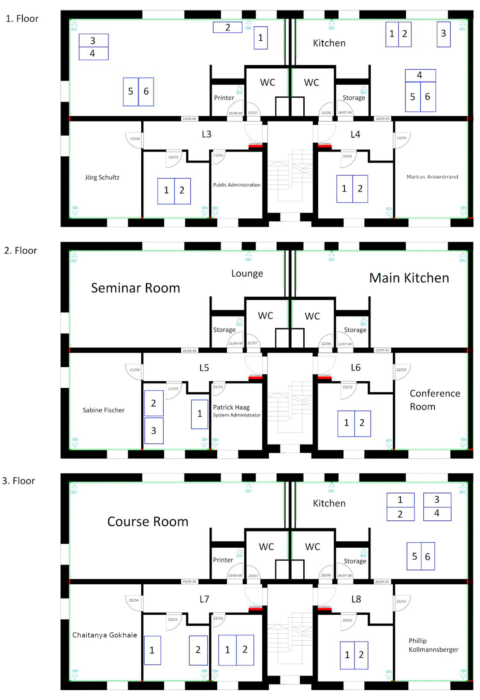

# CCTB Beginners Guide
----
Welcome to the CCTB! Whether you are a new Postdoc or PhD student, or just doing an internship, here you find all necessary information to get you started. If you have any questions, do not hestitate to talk to your colleagues or ask on Mattermost, we are happy to help!

## Table of Contents
1) [Onboarding Checklist](#onboarding)
2) [Map of the CCTB](#map)
3) [Internal Communication](#communication)
    - [Mattermost](#mattermost)
    - [Mailing List](#mailinglist)
    - [Gather Town](#gather)
4) [Computer Workplaces](#computer)
5) [Printers](#printers)
6) [Kitchen](#kitchen)
7) [Library](#library)
8) [Post Office](#post)
9) [Seminar](#seminar)
10) [Hacky Hour & Activities](#hacky)

## 1) Onboarding Checklist:
1) If you are new to the JMU, activate your university account - you should have received information by the RZ.
2) Get access to the building by registering your JMU card: send last 4 digits of card number to your PI
2) Subscribe to the CCTB mailing list: https://lists.uni-wuerzburg.de/mailman/listinfo/cctb
3) Get a CCTB account to access the Terminal servers, GPU workstations and virtual machines
4) Get a Mattermost account and subscribe to relevant groups
5) Enrol in the WueCampus course "CCTB Digital Tools", it contains additional documentation
6) Save these timeslots for obligatory participation:
    - weekly CCTB seminar: Wednesday 11:00-12:00
    - group meetings (ask your PI)

## 2) Map of the CCTB

## 3) Internal Communication

### Mattermost
Mattermost is our self-hosted chat system and main platform for internal communication. Important channels in the main space are "Town Square" and "general" for general information, "it-stuff" for reporting problems and asking questions about our computing environment, or "lunch" for coordinating mensa or kitchen lunch groups. You can join any public channel you want.

You can either point your browser at https://cctb-intern.biologie.uni-wuerzburg.de or use the desktop/mobile app. 

### Mailing List
The CCTB mailing list is used for important announcements. You can sign in via ​
https://lists.uni-wuerzburg.de​. Select the CCTB mailing list and fill out the corresponding form.

### Gather Town
The virtual CCTB in Gathertown is where we meet to have lunch or coffee breaks when working from home: https://gather.town/app/r4oLVM25VSqeXimY/CCTB

## 4) Computer Workplaces
Most desks in the CCTB are equipped with a thin client (PC or Raspberry Pi) running X2Go to access the Gaia terminal servers with your CCTB account. The following servers are available:

| Name | internal IP | external IP | configuration |
---- | ---- | ---- | ---- | 
| gaia2 | 192.168.1.12 | 132.187.198.12 | Xeon E5 2.6GHz, 64 cores, 256GB RAM
| gaia3 | 192.168.1.17 | 132.187.198.17 | Xeon E5 2.6GHz, 64 cores, 256GB RAM
| gaia4 | 192.168.1.18 | 132.187.198.18 | Xeon E5 2.6GHz, 64 cores, 256GB (for teaching)
| gaia5 | 192.168.1.19 | 132.187.198.19 | Xeon E5 2.1 GHz, 32 cores, 128GB RAM

- You can also access the servers using your own computer with SSH or X2Go from within the university network (Eduroam or VPN) using the external IP.
- Some of the dual-display PC clients in L8 have TurboVNC installed for faster remote desktop if you do graphics/imaging work.
- Please do not store any personal data on the PC thin clients, the local logins are not personalized.
- To access virtual machines in the Julia cloud or other computers within the university network, set one of the Gaias as SSH gateway in the X2Go settings.
- Group directories and data storage are mounted under `/storage`.
- For questions or problem reports, please use the `it-stuff` channel on Mattermost, it is also read by our IT admin Patrick Haag.

The Gaias are only for daily email, office, development etc., but not for compute-heavy work. For this, the CCTB has its own in-house slurm-based HPC cluster including one GPU node. Additionally, we have access to the Julia HPC scheduler and private cloud. For details on how to use them, please see the IT guide.

## 5) Printers

There are two color inkjet printers/scanners and two black/white printers in L3 and L7 (first and third floor), in the small rooms on the right. They can be added as TCP/IP printers under Win/Mac/Linux using the following IP addresses from inside the university network:

| Printer | IP-Adress | Type | Location |
---- | ---- | ---- | ---- |
| Lexmark X543 | 132.187.198.98 | Black/White | L3, Room 15/08-09
| Brother MFC-J6930DW | 132.187.198.95 | Color | L3, Room 15/08-09
| Lexmark Universal e260dn | 132.187.198.96 | Black/White | L7, Room 25/05-06
| HP PageWide Pro 477dw MFP | 132.187.198.97 | Color | L7 Room 25/05-06

- The color printers can also be used for scanning documents to a USB stick.
- If paper and/or ink are empty, please refill or replace them. If you take the last cartridge or paper is running low, notify the it-stuff channel in Mattermost.

## 6) Kitchen
The common kitchen on the second floor is the most important room: it has a coffee machine, tea equipment, microwave oven, dishwasher and fridge. You can store and prepare your food there and have lunch and coffee together.
- If you drink coffee, add your name to the list on the wall and put a mark for each cup - the fee is ​0.3€ per cup, instructions how to pay are on the list.
- There is a separate list for soft drinks (Mate etc.), these are 1€ each.
- Sweets in the red bowl are for free as long as everyone contributes something from time to time :)
- Please label your stuff in the fridge, otherwise it might get removed or eaten.
- Put your dirty cups and plates into the dishwasher, not on top, and start it if it is full - instructions are on top.

The kitchen is a common place, so please help to keep it clean and useable. There is a mattermost channel (coffee-stuff) to discuss kitchen issues. The coffee machine responsible is currently Arthur, the cashier is Philip.

## 7) Library
In the back of the seminar room in L5, there is a small library and sofa lounge. It is an official branch of the university library, so books are registered and findable. To borrow a book, fill in the library card and leave it on the shelf.

## 8) Post Office
The Hubland Nord post office is in building 54 and is open 8-12 daily. Incoming mail needs to be collected from there, usually by the PIs. Sending university-internal mail is free - put a "Hauspost" stamp on it. External mail requires a barcode label, available in the secretariat. If you have something to send, either drop it at the post office or put it in the outbox in the printer office in L3, then notify your PI or the Town Square channel.

## 9) Seminar
Every Wednesday at 11:00, we have the CCTB institute seminar - participation is mandatory, language is English.
- Location: currently online only via Zoom, otherwise in the seminar room in L5.
- Schedule: https://hackmd.io/hFWFrZdbRb6VrdI0xQx_YQ?view
- Zoom links and reminders are posted in the cctb-seminar channel.

The seminar is a great opportunity to discuss your research in front of an interdisciplinary, open-minded and friendly audience and to practice e.g. conference talks.

## 10) Hacky Hour & other activities
Check the `hacky-hour` channel and announcements on Mattermonst.